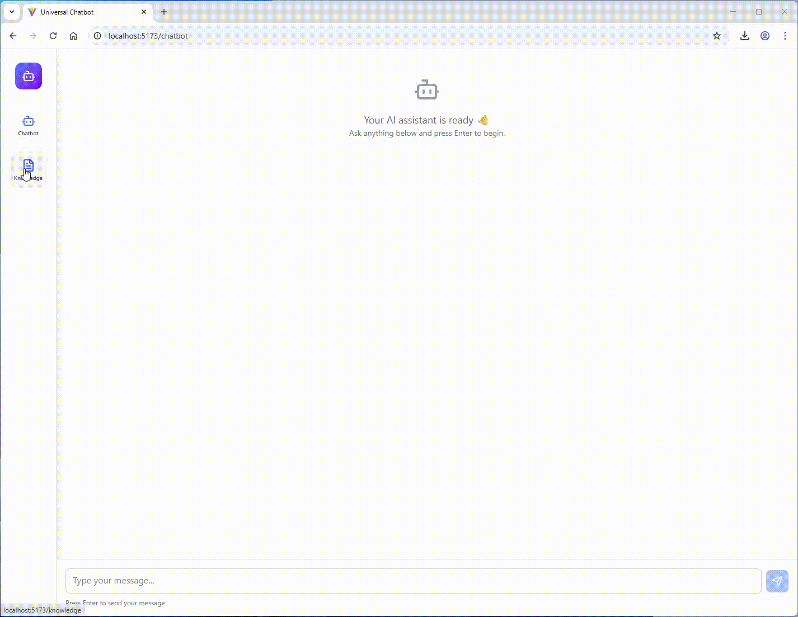
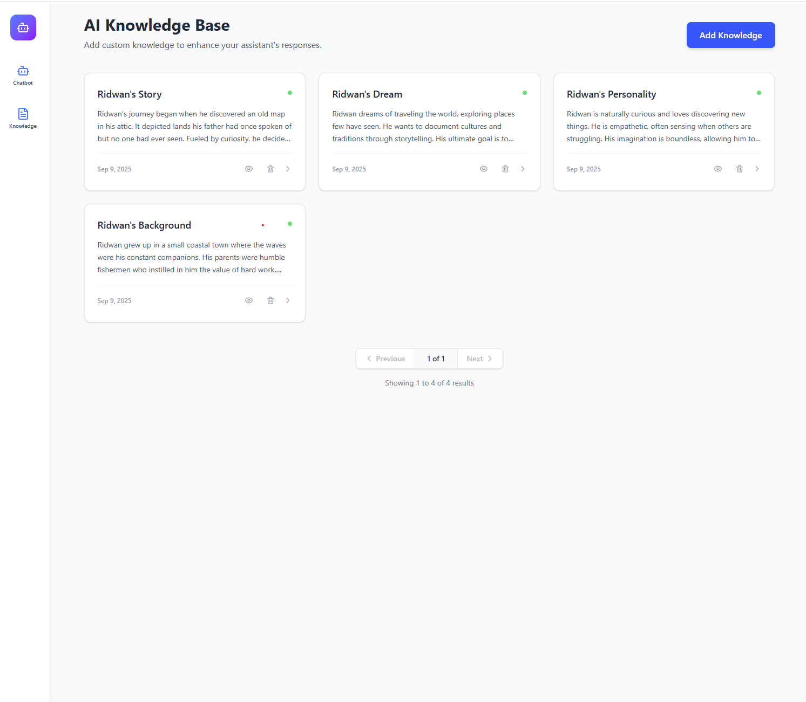
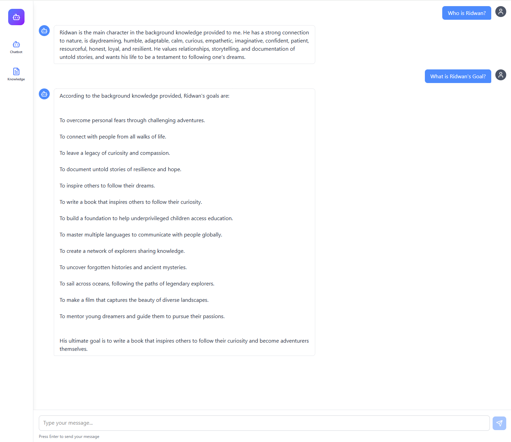
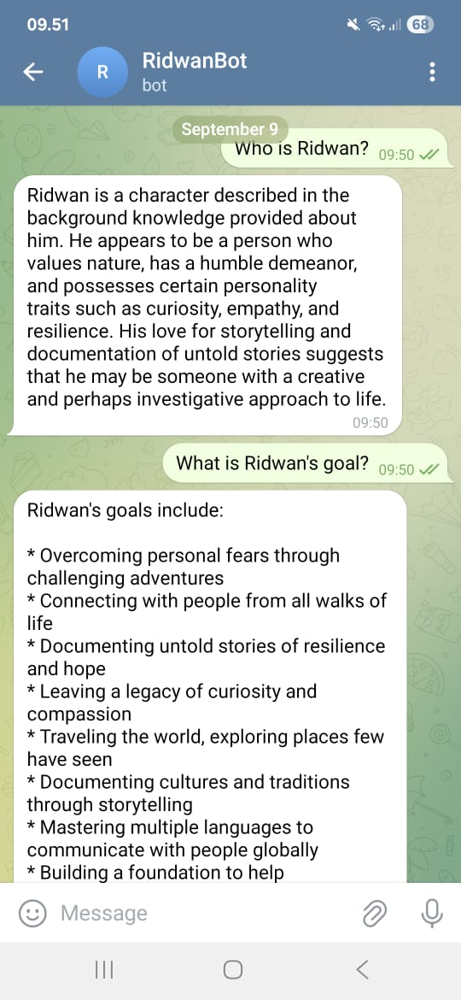

# Universal Chatbot AI - Dynamic RAG Document

This project is an AI-powered dynamic RAG (Retrieval-Augmented Generation) document system. Users can update knowledge through the **Knowledge Page** and test it via the **Chatbot Page**. The system also integrates with Telegram for chatbot functionality and can be deployed to a server.

---

## Services

The project uses Docker Compose to run the following services:

- **Ollama**: AI engine for text generation and embeddings.
- **Qdrant**: Vector database for storing embeddings.
- **Postgres**: Relational database for app data.
- **Backend**: FastAPI backend for API and business logic.
- **Frontend**: Vite + Vue/React frontend (depending on project) for user interface.

---

## Prerequisites

- Docker and Docker Compose installed.
- `.env` file with your Telegram bot token:
```
TELEGRAM_TOKEN=<your-telegram-bot-token>
```

---

## Running the Full Stack

1. Make sure `.env` is set with your `TELEGRAM_TOKEN`.
2. Run the entire stack:

```bash
docker compose up -d
```

- All services will start with default settings.
- If you want custom settings, edit the environment variables in docker-compose.yml for universal_chatbot_backend and the .env in the frontend project (Vite requires env variables at build time).

## Running Services Individually (Development Mode)
You can also run services one by one:

1. Start core services:
```bash
docker compose up -d ollama postgres qdrant
```

2. Frontend:

```bash
cd frontend
# set .env for frontend
npm install
npm run dev
```

3. Backend
```bash
cd backend
# set .env for backend
alembic upgrade head
python -m uvicorn main:app --reload
```

## Telegram Integration
Once your backend is running and accessible via public URL, set the webhook for your Telegram bot:
```
POST https://api.telegram.org/bot{{bot_token}}/setWebhook
Content-Type: application/json

{
  "url": "{{backend url}}/webhook/telegram"
}
```
- You can also use ngrok to expose your local backend to Telegram for testing

## Usage

- Knowledge Page: Add or update knowledge for AI.
- Chatbot Page: Test interactions with AI.
- Telegram: Interact with the chatbot via Telegram once webhook is configured.

## Notes

- Ollama requires GPU if running locally; make sure Docker has GPU access.

- Volumes:
  - `ollama` → persistent storage for Ollama models
  - `qdrant_storage` → persistent vector database
  - `pgdata` → persistent Postgres data

### Demo



## Screenshot




